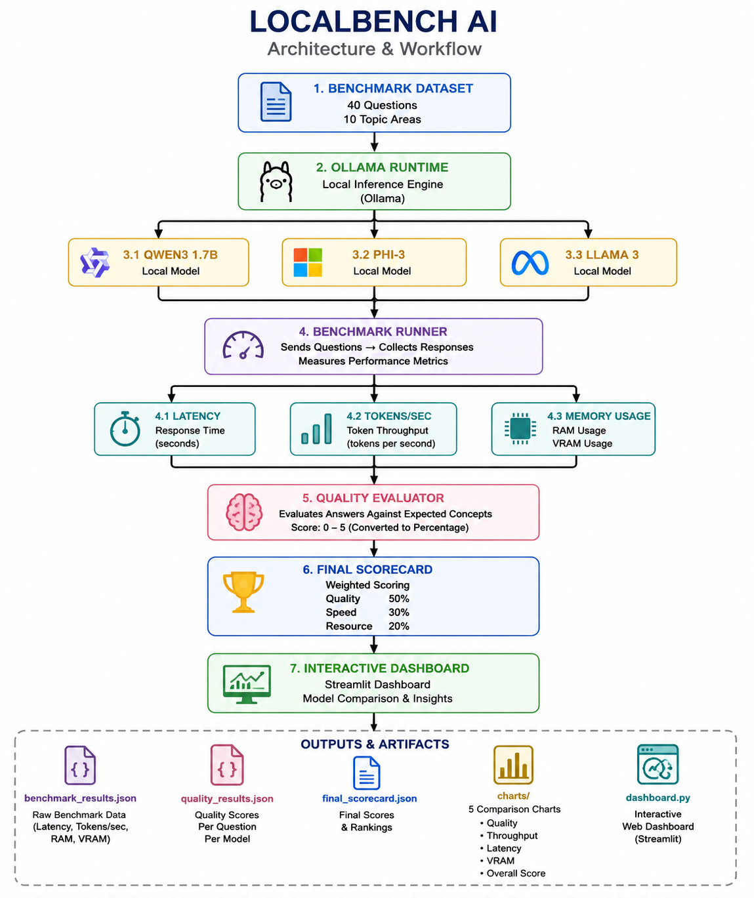
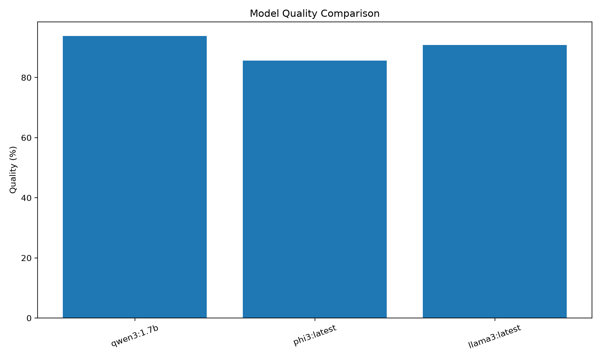
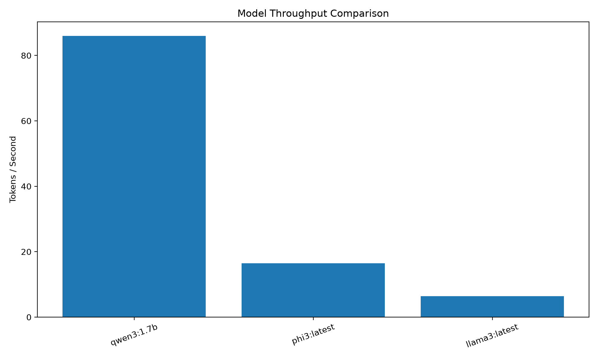
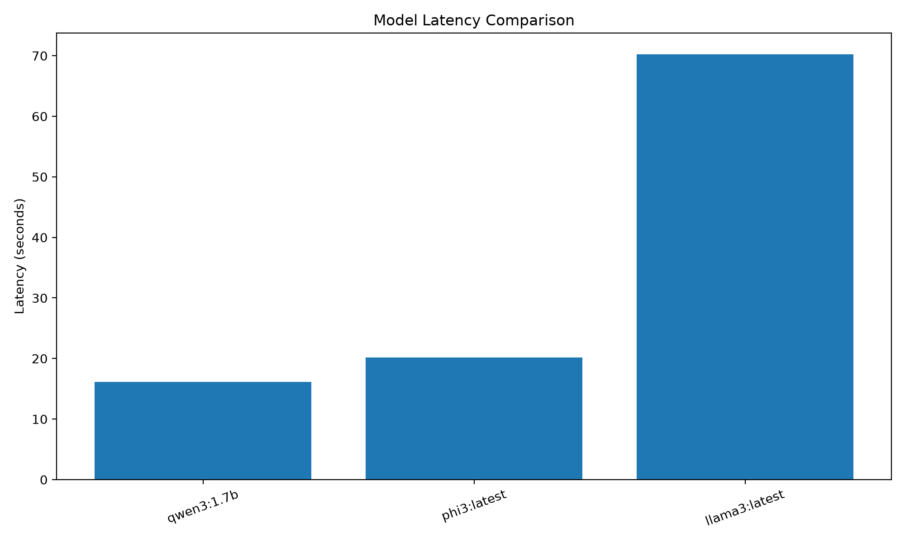
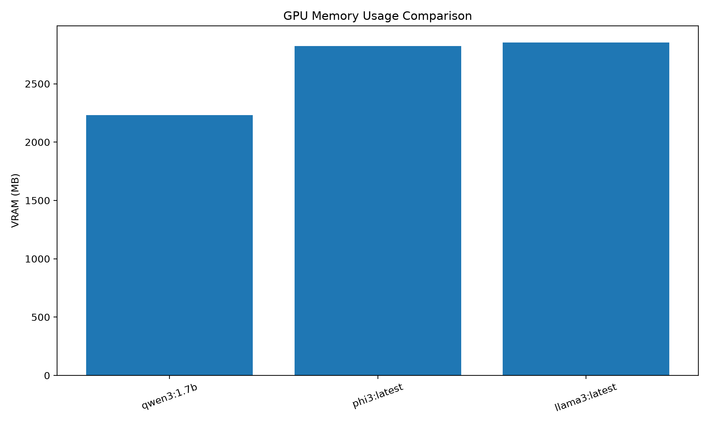
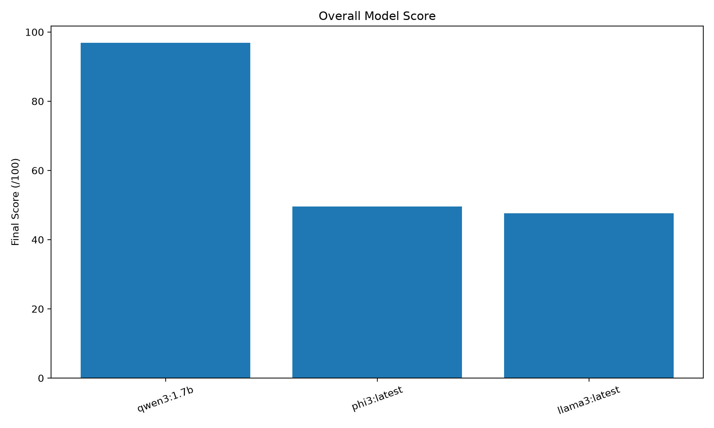

# LocalBench AI

LocalBench AI is a local Large Language Model (LLM) benchmarking system designed to evaluate and compare locally running AI models on real hardware.

It measures model performance across multiple dimensions including:

- Answer quality
- Inference latency
- Token throughput
- RAM usage
- VRAM usage
- Overall performance

The project is designed for resource-constrained systems where running large cloud-based models may not always be practical.

---

## Project Overview

LocalBench AI provides an automated benchmarking pipeline for locally running LLMs using Ollama.

The system sends the same benchmark questions to multiple local models, records hardware and inference metrics, evaluates the generated answers, and produces a final weighted scorecard.

The project also includes an interactive Streamlit dashboard for visualizing benchmark results.

---

## Core Pipeline

```text
                    Benchmark Dataset
                           |
                           v
                    Ollama Runtime
                           |
             +-------------+-------------+
             |             |             |
             v             v             v
        Qwen3 1.7B      Phi-3        Llama 3
             |             |             |
             +-------------+-------------+
                           |
                           v
                    Benchmark Runner
                           |
             +-------------+-------------+
             |             |             |
             v             v             v
          Latency      Tokens/sec     Memory
                                        |
                                  +-----+-----+
                                  |           |
                                  v           v
                                 RAM         VRAM
                                  |
                                  v
                         Quality Evaluator
                                  |
                                  v
                          Final Scorecard
                                  |
                                  v
                       Streamlit Dashboard

---

## Architecture



LocalBench AI is organized into several components:

### Benchmark Dataset

Contains 40 AI and machine learning questions used for consistent model evaluation.

### Ollama Runtime

Provides the local inference layer used to run the selected LLMs on the user's hardware.

### Benchmark Runner

Runs the same questions across all configured models and records:

- Response latency
- Generated tokens
- Tokens per second
- RAM usage
- VRAM usage
- Request status

### Quality Evaluator

Evaluates generated answers using the expected concepts defined in the evaluation rubric.

### Final Scorecard

Combines quality, speed, and resource-efficiency metrics using weighted scoring.

```text
Quality              50%
Speed                30%
Resource Efficiency  20%      

---

## Features

### Automated Benchmarking

Run the same benchmark questions against multiple locally running LLMs.

### Multi-Model Comparison

Compare different local models using the same workload and evaluation methodology.

### Quality Evaluation

Automatically evaluate model responses against expected concepts.

### Performance Measurement

Measure:

- Latency
- Generated tokens
- Tokens per second
- RAM usage
- VRAM usage

### Weighted Scoring

Combine quality, speed, and resource efficiency into a single overall score.

### Visualization

Generate comparison charts for:

- Quality
- Throughput
- Latency
- VRAM
- Overall score

### Interactive Dashboard

Explore benchmark results through a Streamlit-based dashboard.

---

## Benchmark Dataset

The final benchmark contains:

- 40 questions
- 3 local LLM models
- 120 total inference requests

The benchmark covers AI and machine learning concepts including:

- Machine Learning Fundamentals
- Supervised Learning
- Unsupervised Learning
- Model Generalization
- Optimization
- Neural Networks
- Evaluation Metrics
- Data
- Deep Learning
- AI Concepts

All tested models receive the same questions to maintain a consistent comparison.

---

## Models Tested

The benchmark currently evaluates three locally running models through Ollama:

| Model | Purpose |
|-------|---------|
| Qwen3 1.7B | Efficient local inference |
| Phi-3 | Compact local model comparison |
| Llama 3 | Larger model quality comparison |

The models are evaluated using the same benchmark workload and scoring methodology.

---

## Final Benchmark Results

The final benchmark consisted of:

40 Questions × 3 Models = 120 Inference Requests

All 120 requests completed successfully.

### Final Scorecard

| Rank | Model | Quality | Tokens/sec | Avg Latency | VRAM | Overall |
|------|-------|---------|------------|-------------|------|---------|
| 1 | Qwen3 1.7B | 93.8% | 86.01 | 16.13s | 2231 MB | 96.92 |
| 2 | Phi-3 | 85.7% | 16.44 | 20.15s | 2822 MB | 49.60 |
| 3 | Llama 3 | 90.8% | 6.39 | 70.26s | 2855 MB | 47.65 |

### Winners

- Best Overall: Qwen3 1.7B — 96.92/100
- Best Quality: Qwen3 1.7B — 93.8%
- Best Token Throughput: Qwen3 1.7B — 86.01 tokens/sec
- Best Latency: Qwen3 1.7B — 16.13s
- Best VRAM Efficiency: Qwen3 1.7B — 2231 MB

---

---

## Visualization

LocalBench AI generates visual comparisons for the benchmark results.

### Quality Comparison



### Throughput Comparison



### Latency Comparison



### VRAM Comparison



### Overall Score



---

## Interactive Dashboard

LocalBench AI includes an interactive Streamlit dashboard for exploring benchmark results.

The dashboard provides:

- Model rankings
- Quality comparison
- Token throughput comparison
- Latency comparison
- VRAM usage comparison
- Overall score comparison
- Benchmark statistics
- Scoring methodology

Start the dashboard with:

```powershell
streamlit run dashboard.py

---

## Installation

### Requirements

- Python 3.11+
- Ollama
- Local LLM models
- NVIDIA GPU recommended for GPU acceleration
- Windows, Linux, or macOS

The benchmark can also be adapted for CPU-only systems.

### 1. Clone the Repository

```bash
git clone <YOUR_GITHUB_REPOSITORY_URL>
cd LocalBenchAI